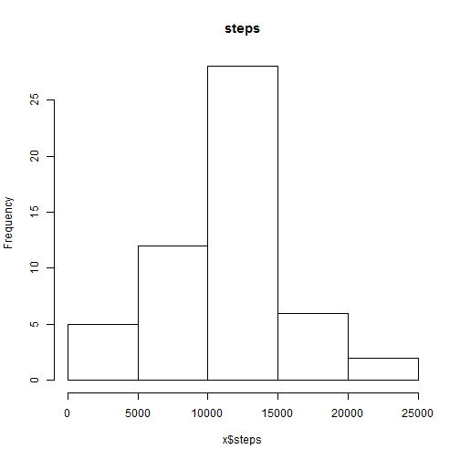
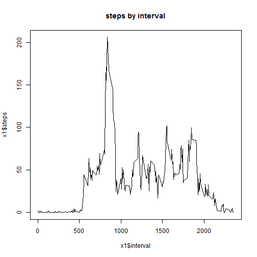

# Reproducible Research: Peer Assessment 1


## Loading and preprocessing the data

1. [Download the data from this location]
(https://d396qusza40orc.cloudfront.net/repdata%2Fdata%2Factivity.zip)
2. Unzip the file and move the csv to the directory to be used as working directory.
3. Set the working directory in R with setwd()
4. read the data into a data frame:


```r
DF <- read.csv("activity.csv")
```


## What is mean total number of steps taken per day?

1. Histogram of steps groupped by date (omitting NAs):


```r
x <- aggregate(steps ~ date, DF, FUN = sum)
hist(x$steps)
```

 


2. Mean and median of steps per day


```r
meanSteps <- mean(x$steps)
medianSteps <- median(x$steps)
```


The mean steps per day is 10766

The median steps per day is 10765

## What is the average daily activity pattern?

1. Plot average steps taken by interval 


```r
x1 <- aggregate(steps ~ interval, DF, FUN = mean)
plot(x1$interval, x1$steps, type = "l")
```

 


2. Which 5-minute interval contains the maximum number of steps


```r
maxSteps <- x1$interval[which.max(x1$steps)]
```


the maximum number of steps(on average) is at interval 835

## Imputing missing values


## Are there differences in activity patterns between weekdays and weekends?
